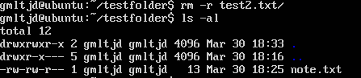

# 🧪 실습 기록 - 1주차 labs.md

> 명령어 실습과 결과를 정리하는 공간입니다.

---

## 📚 Day 3 - 리눅스 명령어 실습

```
mkdir testfolder
cd testfolder
touch note.txt
echo "hello" > note.txt
cat note.txt
cp note.txt copy.txt
mv copy.txt final.txt
rm note.txt
```

## 🖼️ 실습 스크린샷

아래는 명령어 실행 후 실제 결과를 확인한 화면입니다.
파일에 내용을 입력하고, 복사·이동·삭제하는 흐름을 확인할 수 있습니다.

 <br> 

> **cat으로 내용 확인**

<br> 

> **cp → mv → rm 명령어로 파일을 복사, 이름 변경, 삭제까지 수행**

<br> 

> **인용부호(>)부재로 인하여 출력오류**


## 🛠️ Troubleshooting & 기록

echo 명령어에서 작은따옴표(' ')를 사용할 경우, **문자열 처리 방식에 차이**가 있으므로 주의가 필요하다.

rm 명령어는 **복구가 불가능**하므로, 삭제 전에 반드시 파일명을 재확인해야 한다.

## 💭 느낀 점
이전에는 파일을 만드는 것도 GUI(마우스)로만 해봤지만,
터미널에서 키보드만으로 작업을 해보니 **훨씬 효율적이고 직관적인 방식**이라는 걸 느꼈다.
기본 명령어인 cat, echo, mv, rm 등을 직접 써보며
“나도 점점 개발자가 되어가고 있구나”라는 실감을 얻었다.

---

---

## ✅ Day4 학습 주제  
- 리눅스 파일 권한과 소유자 변경

---

## 📘 1. 개념 정리  
- 리눅스의 파일 권한은 세 부분으로 구성된다: 소유자(owner), 그룹(group), 기타(other)  
- 권한은 `r`(읽기), `w`(쓰기), `x`(실행)으로 표시되며, 숫자로는 4, 2, 1로 계산  
- `chmod` 명령어를 사용해 권한을 설정하며, 대표적으로 `chmod 755`는 `rwxr-xr-x` 권한  
- `chown`은 파일의 소유자를 변경할 때 사용하며, 일반적으로 `sudo` 권한이 필요  
- `$USER`는 현재 로그인된 사용자의 계정 이름을 의미하는 환경 변수  
- `ls -l` 명령어를 통해 파일의 소유자 및 권한을 확인할 수 있음

---

## 🧪 2. 실습 내용  

```
mkdir perm-test
cd perm-test
touch script.sh
ls -l script.sh

chmod 755 script.sh
ls -l script.sh

chmod u-x script.sh
ls -l script.sh

sudo chown $USER script.sh
ls -l script.sh

```

## 🖼️ 실습 스크린샷

아래는 명령어 실행 후 실제 결과를 확인한 화면입니다.
파일 권한을 설정하고 변경하며, 시스템 상의 접근 권한이 어떻게 바뀌는지를 확인했습니다.

 <br> 

> **script.sh 파일 생성 직후 기본 권한 확인**

<br> 

> **chmod 755 적용 후 실행 권한 부여됨**

<br> 

> **사용자 실행 권한 제거 후 권한 변화**

<br> 

> **chown 명령어로 소유자를 자신으로 재지정한 결과**

## 🛠️ Troubleshooting & 기록
별다른 에러 없이 실습이 진행됨

이미 파일 소유자가 $USER와 동일한 경우, **chown 명령어는 sudo 없이**도 실행됨

## 💭 느낀 점
숫자 기반의 권한 설정 방식이 실제로 손에 익기 시작했고, **rwx 구조**가 읽히기 시작했다
ls -l 명령어로 권한을 시각적으로 확인하며 시스템 내부 구조를 체득할 수 있었다
**명령어 하나로 시스템 파일을 통제**하는 느낌이 강해져, 리눅스에 대한 자신감이 생겼다

---

## ✅ Day5 학습 주제  
- 리눅스 경로 탐색 명령어 실습  
- 절대경로, 상대경로, 특수 경로(`.`, `..`, `~`) 개념 체득

---

## 📘 1. 개념 정리  
- `pwd`: 현재 위치 확인  
- `cd`: 디렉토리 이동 (절대/상대/특수 경로 전부 가능)  
- `~`: 내 홈 디렉토리 (`/home/heeary`)  
- `.`: 현재 위치  
- `..`: 상위 디렉토리  
- `mkdir`: 새 폴더 생성  
- `touch`: 빈 파일 생성  
- `file`: 파일 유형 확인  
- `tree`: 디렉토리 구조 시각화 출력

---

## 🧪 2. 실습 내용

```
pwd                         # 현재 위치 확인
cd ~                        # 홈 디렉토리로 이동
cd /etc                     # 절대경로로 이동
cd ..                       # 상위 디렉토리로 이동
cd .                        # 현재 위치 유지 (명시적 표현)
mkdir test-dir              # 테스트용 폴더 생성
cd test-dir                 # 생성한 폴더로 이동
touch test.txt              # 빈 텍스트 파일 생성
file test.txt               # 파일 유형 확인
tree                        # 현재 디렉토리 구조 출력
```

---

## 🖼️ 실습 스크린샷

아래는 명령어 실행 후 실제 결과를 확인한 화면입니다.  
경로 탐색, 디렉토리 생성, 파일 생성 및 구조 확인의 흐름을 정리했습니다.

<br> 

> **`pwd` 명령어로 현재 위치 확인: `/home/heeary`**

<br> 

> **`file` 명령어로 파일 타입 확인: `test.txt`는 빈 파일(empty)**

<br> 

> **`tree` 명령어로 디렉토리 구조 출력: `test.txt` 포함된 단순 구조**

---

## 🛠️ Troubleshooting & 기록  
- 모든 명령어 정상 작동  
- `tree` 명령어가 없을 경우: `sudo apt install tree`로 설치 필요

---

## 💭 느낀 점  
처음엔 `..`, `./`, `/` 같은 경로 기호들이 헷갈렸지만  
직접 입력하고 이동하면서 감이 잡히기 시작했다.  
특히 `tree` 명령어를 통해 구조를 눈으로 보는 게 굉장히 도움이 됐다.

---

## ✅ Day6 학습 주제  
- 리눅스에서 파일 및 디렉토리 조작 명령어 실습  
- **복사, 이동, 삭제, 검색, 명령어 위치 확인** 등 CLI 조작 감각 익히기

---

## 📘 1. 개념 정리  

- `cp`: **파일 복사**  
- `mv`: **파일 이동 또는 이름 변경**  
- `rm`: **파일 삭제 (복구 불가, 신중히!)**  
- `find`: **이름 또는 조건으로 파일 찾기**  
- `which`: **명령어가 설치된 경로 확인**  
- `man`: **명령어 매뉴얼(설명서) 열람**

---

## 🧪 2. 실습 내용  

```
mkdir file-practice && cd file-practice         # 실습 디렉토리 생성 및 진입

touch a.txt b.txt c.txt                         # 테스트용 파일 생성
cp a.txt copy_a.txt                             # a.txt → copy_a.txt 복사
mv b.txt renamed_b.txt                          # b.txt 이름 변경
rm c.txt                                        # c.txt 삭제

mkdir backup && cp -r backup backup-copy        # 디렉토리 복사
find . -name "copy_a.txt"                       # 특정 파일 검색
which tree                                      # tree 명령어 위치 확인
man cp                                          # cp 명령어 설명서 열람 (종료: q)
```
---

## 🖼️ 실습 스크린샷

<br> 
> **a.txt, b.txt, c.txt 생성 후 초기 상태 확인**

<br> 
> **a.txt → copy_a.txt로 복사 완료**

<br> 
> **b.txt → renamed_b.txt로 이름 변경됨**

<br> 
> **find 명령어로 copy_a.txt 경로 확인**

<br> 
> **tree 명령어 위치 확인 (/usr/bin/tree 등)**

---

## 🛠️ Troubleshooting & 기록  
- `man` 명령어는 **`q` 키로 종료**해야 한다는 점 주의  
- `tree` 명령어가 없다면 → `sudo apt install tree`로 설치  
- `find` 명령어 사용 시 `-name` 옵션은 **반드시 따옴표로 감싸야 작동함**


---

## 💭 느낀 점  
처음엔 `cp`, `mv`, `rm` 같은 기본 명령어들이 단순해 보여도  
**직접 입력하며 구조를 바꿔보는 경험**이였다

---

## ✅ Day7 학습 주제  
- 리눅스 프로세스 관리 명령어 실습  
- ps, top, kill, nice, renice 명령어의 동작 이해 및 우선순위 확인

---

## 📘 1. 개념 정리  
- `ps`: 현재 실행 중인 프로세스를 목록으로 확인  
- `top`: 실시간으로 CPU, 메모리, 프로세스 상태 확인 (NI: nice값 열 포함)  
- `kill`: 특정 PID를 종료  
- `nice`: 새로운 프로세스를 낮은 우선순위로 실행  
- `renice`: 실행 중인 프로세스의 우선순위를 변경 (`sudo` 필요)  
- `sleep`: 테스트용으로 장시간 실행되는 프로세스를 생성

---

## 🧪 2. 실습 내용  

```
# 1. 테스트용 프로세스 생성
sleep 1000 &                            # 백그라운드에서 오랫동안 실행되는 프로세스
ps aux | grep sleep                    # PID 확인

# 2. 낮은 우선순위로 프로세스 실행
nice -n 10 sleep 1000 &                 # nice 값 10으로 실행

# 3. top 명령어로 우선순위(NI) 확인
top                                     # 실행 중인 프로세스 확인 (NI 열: 10 확인)

# 4. 우선순위 변경 (높은 우선순위로)
sudo renice -n -5 <PID>                 # PID는 위에서 확인한 sleep 프로세스

# 5. 우선순위가 바뀌었는지 재확인
top                                     # NI 열이 -5로 바뀐 것 확인
ps -p <PID> -o pid,ni,comm              # 명확하게 숫자 값만 추출해서 확인

# 6. 프로세스 종료
kill <PID>                              # 정상 종료
kill -9 <PID>                           # 안 되면 강제 종료
```

---

## 🖼️ 실습 스크린샷

<br> 
> **ps aux로 sleep 프로세스 PID 확인**

<br> 
> **nice -n 10 으로 실행된 프로세스**

<br> 
> **renice -n -5 명령 이후 top에서 NI -5로 변경**

---

---

## 🛠️ Troubleshooting & 기록

- `renice` 사용 시 `sudo` 없이 실행하면 **Operation not permitted** 에러 발생 → 반드시 `sudo` 사용 필요
- `top`에서 **NI 열**을 통해 우선순위(nice 값) 확인 가능
- `kill` 명령어로 정상 종료가 안 될 경우 `kill -9`로 강제 종료해야 함
- PID를 잘못 입력하면 엉뚱한 프로세스를 종료하거나 우선순위를 바꿀 수 있으므로 **확인 후 실행 필수**

---

## 💭 느낀 점

처음에는 `nice`와 `renice`가 비슷하게 느껴졌지만,  
**"시작 전에 설정"과 "실행 중에 조절"의 차이**를 실습을 통해 직접 체감할 수 있었다.

특히 `top` 명령어를 통해 실시간으로 NI 값이 바뀌는 걸 보는 순간,  
**내가 프로세스를 컨트롤한다는 느낌**이 확실히 들었다.


