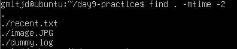
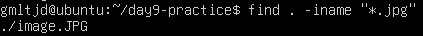
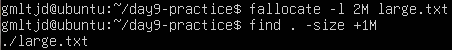
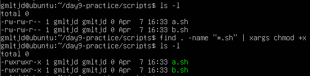
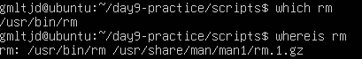

# 🧪 실습 기록 - 2주차 labs.md

> 명령어 실습과 결과를 정리하는 공간입니다.

---

## ✅ Day8 학습 주제  

- `find` 명령어 활용 심화 실습
- `-name`, `-delete`, `-exec`, `-print0 | xargs -0` 방식 비교
- 공백 포함 파일 처리 실습 포함

---

## 📘 1. 개념 정리  
- `find`는 조건에 맞는 파일/디렉토리를 검색하는 명령어
- `-name "*.확장자"`로 원하는 형식의 파일만 필터링 가능
- `-delete`는 `find` 자체 기능으로 삭제 수행
- `-exec`은 외부 명령을 각각 실행 (느리지만 유연함)
- `-print0` + `xargs -0`은 공백이 있는 파일 처리에 유리

---

## 🧪 2. 실습 명령어  

```
mkdir find-test                     # 실습용 디렉토리 생성
cd find-test                        # 디렉토리로 이동
touch a.log b.log c.txt "my log.log"   # 다양한 파일 생성
find . -name "*.log"               # .log 파일 검색
find . -name "*.log" -delete       # .log 파일 전체 삭제
touch a.log b.log "my log.log"     # 다시 .log 파일 생성
find . -name "*.log" -print0 | xargs -0 rm  # xargs로 정확 삭제
touch a.log b.log                  # .log 다시 생성
find . -name "*.log" -exec rm {} \;     # exec 방식 삭제
```

---

## 🖼️ 실습 스크린샷

<p align="center">
  <br/>
  > 다양한 확장자 & 공백 포함된 파일 생성 확인
</p>

<p align="center">
  <br/>
  > find 명령어로 `.log` 파일만 필터링 결과 출력
</p>

<p align="center">
  <br/>
  > -delete 옵션으로 .log 파일이 삭제된 상태
</p>

<p align="center">
  <br/>
  > 다시 공백 포함된 파일 포함하여 .log 파일 생성됨
</p>

<p align="center">
  <br/>
  > xargs -0 방식으로 공백 포함된 파일까지 정확히 삭제됨
</p>

<p align="center">
  <br/>
  > 마지막 exec 실습 전, 파일 재생성 상태
</p>

<p align="center">
  <br/>
  > exec 방식으로 모든 .log 파일 삭제 완료
</p>

---

## 🛠️ Troubleshooting & 기록

- 공백이 포함된 파일명은 기본 `xargs`로 처리 시 오류 발생 가능  
  → `-print0 | xargs -0` 조합을 사용해 정확히 처리해야 함
- `-exec`은 한 파일씩 실행되므로 많은 파일에는 비효율적일 수 있음
- `-delete`는 빠르지만 되돌릴 수 없어 주의 필요

---

## 💭 느낀 점

이번 실습은 단순 명령어 암기를 넘어서,  
**“파일 시스템을 실제로 제어해보는 감각”**을 길렀다고 느꼈다.  

공백 파일은 그동안 신경도 안 썼지만,  
`xargs -0` 같은 처리법을 통해 실무에서 필요한 세밀한 제어법을 배웠다.  

---

## ✅ 학습 주제  
- `find` 명령어 고급 사용법 (`-mtime`, `-size`, `-iname`)  
- `-exec`, `xargs` 명령어 활용  
- 조건에 따라 자동 삭제/권한부여 등 실습  

---

## 📘 1. 개념 정리  

- `-mtime -N` : 최근 N일 이내에 수정된 파일 찾기  
- `-size +1M` : 특정 크기(예: 1MB 초과)인 파일 검색  
- `-iname "*.확장자"` : 대소문자 구분 없이 확장자 검색  
- `-exec <명령어> {} \;` : 찾은 파일에 직접 명령 실행  
- `xargs <명령어>` : find 결과를 파이프처럼 넘겨 반복 실행  
- `which`, `whereis` : 명령어의 설치 위치 확인  

---

## 🧪 2. 실습 내용  

```
mkdir day9-practice
cd day9-practice
touch old.txt recent.txt image.JPG dummy.log

touch -d "3 days ago" old.txt
find . -mtime -2

find . -iname "*.jpg"

fallocate -l 2M large.txt
find . -size +1M

find . -name "*.log" -exec rm {} \;

mkdir scripts
touch scripts/a.sh scripts/B.sh
find scripts -iname "*.sh" | xargs chmod +x
ls -l scripts

which chmod
whereis chmod
```

---

## 🖼️ 실습 스크린샷

아래는 명령어 실행 결과를 캡처한 화면입니다.  
조건 검색, 자동 삭제 및 권한 변경까지의 과정을 확인할 수 있습니다.

<p align="center">
  <br/>
  > 최근 2일 이내 수정된 파일만 검색
</p>

<p align="center">
  <br/>
  > 확장자를 대소문자 구분 없이 검색
</p>

<p align="center">
  <br/>
  > 1MB 이상 크기의 파일을 찾아 출력
</p>

<p align="center">
  <br/>
  > `.sh` 파일들에 실행 권한 부여 결과
</p>

<p align="center">
  <br/>
  > `which`와 `whereis`로 명령어 위치 확인
</p>


---

## 🛠️ Troubleshooting & 기록  

- `find` 명령어에서 `-name` 또는 `-iname` 옵션 뒤에는 **반드시 따옴표("")로 감싸야 정상 작동**  
  > 예: `find . -name "*.txt"` ← ✅  
- `-exec` 뒤에 오는 명령어는 `{}`로 파일명을 넘기고, `\;`으로 종료해야 함  
  > (`\;`는 세미콜론을 리눅스에서 해석하지 않도록 escape 처리한 것)  
- `fallocate` 명령어는 더미 파일을 빠르게 만들 때 유용  
- `xargs`는 파일 이름이 공백 포함일 경우 잘못 작동할 수 있으므로  
  > 복잡한 상황에서는 `-print0` + `xargs -0` 조합 사용이 더 안전함

---

## 💭 느낀 점  

처음엔 `find` 명령어가 단순히 "파일 찾기" 정도라고만 생각했지만,  
`-mtime`, `-size`, `-iname` 같은 조건을 직접 써보면서  
**실제 파일 정리 자동화에도 강력하게 활용된다는 걸 체감했다.**

특히 `xargs`, `-exec`와의 조합은 단순 반복 명령이 아니라  
**내가 직접 만들어내는 미니 자동화 툴** 같아서 굉장히 흥미로웠다.


