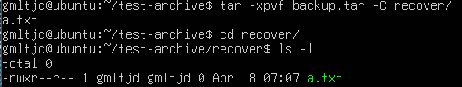

# 🧪 실습 기록 - 2주차 labs.md

> 명령어 실습과 결과를 정리하는 공간입니다.

---

## ✅ Day8 학습 주제  

- `find` 명령어 활용 심화 실습
- `-name`, `-delete`, `-exec`, `-print0 | xargs -0` 방식 비교
- 공백 포함 파일 처리 실습 포함

---

## 📘 1. 개념 정리  
- `find`는 조건에 맞는 파일/디렉토리를 검색하는 명령어
- `-name "*.확장자"`로 원하는 형식의 파일만 필터링 가능
- `-delete`는 `find` 자체 기능으로 삭제 수행
- `-exec`은 외부 명령을 각각 실행 (느리지만 유연함)
- `-print0` + `xargs -0`은 공백이 있는 파일 처리에 유리

---

## 🧪 2. 실습 명령어  

```
mkdir find-test                     # 실습용 디렉토리 생성
cd find-test                        # 디렉토리로 이동
touch a.log b.log c.txt "my log.log"   # 다양한 파일 생성
find . -name "*.log"               # .log 파일 검색
find . -name "*.log" -delete       # .log 파일 전체 삭제
touch a.log b.log "my log.log"     # 다시 .log 파일 생성
find . -name "*.log" -print0 | xargs -0 rm  # xargs로 정확 삭제
touch a.log b.log                  # .log 다시 생성
find . -name "*.log" -exec rm {} \;     # exec 방식 삭제
```

---

## 🖼️ 실습 스크린샷

<p align="center">
  <br/>
  > 다양한 확장자 & 공백 포함된 파일 생성 확인
</p>

<p align="center">
  <br/>
  > find 명령어로 `.log` 파일만 필터링 결과 출력
</p>

<p align="center">
  <br/>
  > -delete 옵션으로 .log 파일이 삭제된 상태
</p>

<p align="center">
  <br/>
  > 다시 공백 포함된 파일 포함하여 .log 파일 생성됨
</p>

<p align="center">
  <br/>
  > xargs -0 방식으로 공백 포함된 파일까지 정확히 삭제됨
</p>

<p align="center">
  <br/>
  > 마지막 exec 실습 전, 파일 재생성 상태
</p>

<p align="center">
  <br/>
  > exec 방식으로 모든 .log 파일 삭제 완료
</p>

---

## 🛠️ Troubleshooting & 기록

- 공백이 포함된 파일명은 기본 `xargs`로 처리 시 오류 발생 가능  
  → `-print0 | xargs -0` 조합을 사용해 정확히 처리해야 함
- `-exec`은 한 파일씩 실행되므로 많은 파일에는 비효율적일 수 있음
- `-delete`는 빠르지만 되돌릴 수 없어 주의 필요

---

## 💭 느낀 점

이번 실습은 단순 명령어 암기를 넘어서,  
**“파일 시스템을 실제로 제어해보는 감각”**을 길렀다고 느꼈다.  

공백 파일은 그동안 신경도 안 썼지만,  
`xargs -0` 같은 처리법을 통해 실무에서 필요한 세밀한 제어법을 배웠다.  

---

## ✅ Day9 학습 주제  
- `find` 명령어 고급 사용법 (`-mtime`, `-size`, `-iname`)  
- `-exec`, `xargs` 명령어 활용  
- 조건에 따라 자동 삭제/권한부여 등 실습  

---

## 📘 1. 개념 정리  

- `-mtime -N` : 최근 N일 이내에 수정된 파일 찾기  
- `-size +1M` : 특정 크기(예: 1MB 초과)인 파일 검색  
- `-iname "*.확장자"` : 대소문자 구분 없이 확장자 검색  
- `-exec <명령어> {} \;` : 찾은 파일에 직접 명령 실행  
- `xargs <명령어>` : find 결과를 파이프처럼 넘겨 반복 실행  
- `which`, `whereis` : 명령어의 설치 위치 확인  

---

## 🧪 2. 실습 내용  

```
mkdir day9-practice
cd day9-practice
touch old.txt recent.txt image.JPG dummy.log

touch -d "3 days ago" old.txt
find . -mtime -2

find . -iname "*.jpg"

fallocate -l 2M large.txt
find . -size +1M

find . -name "*.log" -exec rm {} \;

mkdir scripts
touch scripts/a.sh scripts/B.sh
find scripts -iname "*.sh" | xargs chmod +x
ls -l scripts

which chmod
whereis chmod
```

---

## 🖼️ 실습 스크린샷

아래는 명령어 실행 결과를 캡처한 화면입니다.  
조건 검색, 자동 삭제 및 권한 변경까지의 과정을 확인할 수 있습니다.

<p align="center">
  <br/>
  > 최근 2일 이내 수정된 파일만 검색
</p>

<p align="center">
  <br/>
  > 확장자를 대소문자 구분 없이 검색
</p>

<p align="center">
  <br/>
  > 1MB 이상 크기의 파일을 찾아 출력
</p>

<p align="center">
  <br/>
  > `.sh` 파일들에 실행 권한 부여 결과
</p>

<p align="center">
  <br/>
  > `which`와 `whereis`로 명령어 위치 확인
</p>


---

## 🛠️ Troubleshooting & 기록  

- `find` 명령어에서 `-name` 또는 `-iname` 옵션 뒤에는 **반드시 따옴표("")로 감싸야 정상 작동**  
  > 예: `find . -name "*.txt"` ← ✅  
- `-exec` 뒤에 오는 명령어는 `{}`로 파일명을 넘기고, `\;`으로 종료해야 함  
  > (`\;`는 세미콜론을 리눅스에서 해석하지 않도록 escape 처리한 것)  
- `fallocate` 명령어는 더미 파일을 빠르게 만들 때 유용  
- `xargs`는 파일 이름이 공백 포함일 경우 잘못 작동할 수 있으므로  
  > 복잡한 상황에서는 `-print0` + `xargs -0` 조합 사용이 더 안전함

---

## 💭 느낀 점  

처음엔 `find` 명령어가 단순히 "파일 찾기" 정도라고만 생각했지만,  
`-mtime`, `-size`, `-iname` 같은 조건을 직접 써보면서  
**실제 파일 정리 자동화에도 강력하게 활용된다는 걸 체감했다.**

특히 `xargs`, `-exec`와의 조합은 단순 반복 명령이 아니라  
**내가 직접 만들어내는 미니 자동화 툴** 같아서 굉장히 흥미로웠다.

---

## Day10 ✅ 학습 주제  
- `zip` / `tar` 명령어 실습을 통한 압축, 해제, 복원 이해  
- 압축 포맷 별 동작 방식과 권한 처리 방식 비교  

---

## 📘 1. 개념 정리  
- `zip`: 파일 압축 및 선택적 해제가 가능하며, 보편적으로 사용됨  
- `unzip -l`: 압축 해제 없이 내부 구조를 확인  
- `tar`: 파일을 하나로 묶고, 권한까지 보존 가능 (`-p` 옵션)  
- `tar -tvf`: 압축을 풀지 않고 내부 내용을 확인  
- `tar -xvf`: 압축 해제  
- `tar -xpvf`: 권한 보존하며 압축 해제  
- `-C`: 압축 해제 위치를 지정하는 옵션  

---

## 🧪 2. 실습 내용  

```
mkdir test-archive           # 테스트용 디렉토리 생성
cd test-archive              # 디렉토리 이동

touch a.txt b.txt c.txt      # 샘플 파일 3개 생성
chmod 744 a.txt              # a.txt에 실행 권한 포함 설정

zip sample.zip a.txt b.txt   # zip으로 파일 2개 압축
unzip -l sample.zip          # zip 내부 목록 확인
unzip sample.zip a.txt       # a.txt만 압축 해제

tar -cvf archive.tar c.txt   # c.txt만 tar로 묶어서 압축
tar -tf archive.tar          # tar 내부 구조 확인
tar -xvf archive.tar         # tar 압축 해제

tar -cpvf backup.tar a.txt   # 권한 유지 포함하여 tar 백업
mkdir recover                # 복원 테스트용 디렉토리 생성
sudo tar -xpvf backup.tar -C recover/  # 권한 유지하며 복원
```

---

## 🖼️ 실습 스크린샷

<p align="center">
  <br/>
  > `a.txt`에 `744` 권한을 부여하고 `ls -l`로 확인한 모습
</p>

<p align="center">
  <br/>
  > `unzip -l` 명령어로 `sample.zip` 내부 구조 확인
</p>

<p align="center">
  <br/>
  > `a.txt`만 선택적으로 압축 해제한 결과
</p>

<p align="center">
  <br/>
  > `tar -tvf archive.tar`로 내부 파일 확인
</p>

<p align="center">
  <br/>
  > `recover/` 디렉토리 안에 압축 해제된 `a.txt`의 권한 확인
</p>

---

## 🛠️ Troubleshooting & 기록

- `tar -xpvf` 명령어를 사용할 때는 반드시 `sudo`를 붙여야 **권한 보존이 정확하게 작동**함
- `unzip`은 **선택적 해제가 가능**하지만 `tar`은 전체 해제 또는 경로 지정이 필요
- `unzip sample.zip a.txt`처럼 **부분 해제 명령어도 깔끔하게 작동**함

---

## 💭 느낀 점

이번 실습을 통해 처음에는 단순하게 보였던 `압축 명령어`들이  
상황에 따라 얼마나 다르게 작동하는지 체감할 수 있었다.

특히 `zip`과 `tar`의 **압축 구조와 철학 자체가 다르다**는 걸 느꼈다.  
zip은 유연하고 편하고, tar는 단단하고 시스템 친화적인 느낌!

또한 `tar -cpvf`와 `-xpvf`를 통해  
단순 백업이 아닌 **퍼미션까지 포함한 복원**이 가능하다는 점이 인상 깊었다.

---

## ✅ Day 11 학습 주제  
- Cron을 활용한 작업 자동화 실습  
- `crontab`, `@reboot`, 로그 출력, 작업 확인 명령어 실습

---

## 📘 1. 개념 정리  
- `cron`은 특정 시간에 명령어를 자동 실행할 수 있는 리눅스 예약 작업 도구  
- `crontab -e`: 크론 작업 등록 (사용자 단위)
- `crontab -l`: 등록된 크론 작업 목록 보기  
- `* * * * *`: 분, 시, 일, 월, 요일 순서로 설정  
- `@reboot`: 시스템 부팅 후 실행되는 예약 작업  
- `>> 파일`: 출력 결과를 해당 파일에 추가  
- `$(date)`: 현재 날짜와 시간을 문자열로 반환

---

## 🧪 2. 실습 내용  

```
mkdir -p ~/cron-logs                    # 로그 저장용 폴더 생성
mkdir -p ~/cron-logs/reboot-test        # @reboot 확인용 폴더 생성
sudo service cron status                # cron 서비스 실행 여부 확인 (Ubuntu)
crontab -e                              # 사용자 크론 편집기 열기

# 아래 명령어를 crontab에 등록
* * * * * echo "cron testing: $(date)" >> /home/gmltjd/cron-logs/test.log
@reboot mkdir -p /home/heeary/cron-logs/reboot-test

crontab -l                              # 크론 등록 여부 확인
tree ~/cron-logs                        # 로그 구조 확인
cat ~/cron-logs/test.log                # 로그 내용 확인
```

---

## 🖼️ 실습 스크린샷  

<p align="center">
  <br/>
  > `crontab -e`에서 작업 추가 등록한 모습
</p>

<p align="center">
  <br/>
  > `crontab -l` 명령어로 현재 작업 확인
</p>

<p align="center">
  <br/>
  > `/cron-logs/test.log`에 로그가 누적되는 결과
</p>

<p align="center">
  <br/>
  > `@reboot` 명령으로 생성된 `reboot-test/` 폴더 확인
</p>

---

## 🛠️ Troubleshooting & 기록  

- `crontab -e` 첫 실행 시 편집기 선택 화면(`select-editor`)이 나올 수 있음  
- `~` 또는 `$HOME` 경로는 일부 환경에서 인식되지 않아 **절대경로 사용**이 안전  
- 로그 파일이 안 생긴다면:  
  1. `cron` 서비스가 비활성 상태일 수 있음 (`sudo service cron start`)  
  2. 경로를 상대경로로 써서 인식되지 않는 경우  

---

## 💭 느낀 점  

오늘은 리눅스의 "자동화 도구"인 **Cron**을 직접 실습하면서  
**내가 정의한 명령이 자동으로 실행되는 경험**을 할 수 있었다.

특히, `@reboot`는 서버 관리에 꼭 필요한 기능이라는 걸 실감했다.  
GUI 없이 명령만으로 시간을 예약하고 작업을 맡긴다는 점에서,  
**운영자 중심의 시스템 사고방식**을 체득

---

## ✅ Day12 학습 주제  
- 다양한 압축 명령어 실습 (tar, zip)  
- 디렉토리 제외 및 파일명 변경 기능 실습  
- 압축 파일 내부 구조 확인과 복원

---

## 📘 1. 개념 정리  
- `tar`: 여러 파일을 하나로 묶는 아카이빙 도구. 옵션에 따라 gzip, bzip2 등의 압축도 지원  
- `zip`: 아카이빙과 압축을 동시에 수행하는 명령어  
- `--exclude`: 특정 파일/디렉토리를 압축 대상에서 제외  
- `--transform`: 압축 파일 내 경로/이름을 변경  
- `-C`: 압축 시 또는 해제 시 기준 경로를 지정

---

## 🧪 2. 실습 내용

```
tar -czvf archive.tar.gz .                                        # gzip 형식으로 현재 디렉토리 압축
tar -tzvf archive.tar.gz                                          # 압축 파일 내부 파일 목록 확인
mkdir ../recover && tar -xzvf archive.tar.gz -C ../recover        # 압축 해제 후 복원 디렉토리에 내용 저장
zip -r sample.zip .                                               # zip 형식으로 전체 압축
unzip -l sample.zip # zip 내부 파일 구조 확인
tar --exclude=subdir -czvf no-subdir.tar.gz .                     # subdir 디렉토리를 제외하고 압축
tar --transform='s/file1.txt/renamed.txt/' -czvf renamed.tar.gz . # 압축 안에서 파일명 변경
```

---

## 🖼️ 실습 스크린샷  

<p align="center">
  <br/>
  > `tar -czvf archive.tar.gz .` 명령어로 gzip 형식으로 현재 디렉토리 압축
</p>

<p align="center">
  <br/>
  > `tar -tzvf archive.tar.gz`로 내부 파일 구조 출력
</p>

<p align="center">
  <br/>
  > 복원 디렉토리(`../recover`)에 압축 해제한 결과
</p>

<p align="center">
  <br/>
  > `zip -r sample.zip .` 명령어로 zip 형식 압축 수행
</p>

<p align="center">
  <br/>
  > `unzip -l sample.zip`로 zip 파일 구조 확인
</p>

<p align="center">
  <br/>
  > `--exclude=subdir` 옵션으로 해당 디렉토리를 제외하고 압축
</p>

<p align="center">
  <br/>
  > `--transform='s/file1.txt/renamed.txt/'` 옵션으로 압축 내 파일명 변경
</p>

---

## 🛠️ Troubleshooting & 기록  

- `tar: Removing leading '/' from member names` → 절대 경로를 압축할 경우 자동으로 슬래시 제거  
- `--transform` 사용 시 실제 파일명이 정확히 일치해야 작동  
- `--exclude=subdir/` 와 같이 `/`를 붙여줘야 정확한 디렉토리 제외 가능

---

## 💭 느낀 점  

이번 실습은 단순 압축을 넘어서 **압축 대상 조절과 이름 변경까지 확장된 활용**을 경험했다.  
특히 `--transform`은 압축 안의 경로까지 조작할 수 있다는 점에서 아주 강력한 옵션이었다.  

명령어만 외우는 게 아니라 **정확한 맥락에서의 사용법과 옵션 구조까지 이해**하는 게 중요하다는 걸 느꼈다.  
하나하나 실습해가며 **압축 시스템 전반에 대한 감각이 생겼다.**


