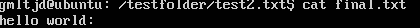
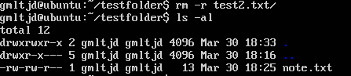
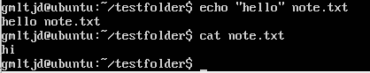

# 🧪 실습 기록 - labs.md

> 명령어 실습과 결과를 정리하는 공간입니다.

---

## 📚 Day 2 - 리눅스 명령어 실습

```
mkdir testfolder
cd testfolder
touch note.txt
echo "hello" > note.txt
cat note.txt
cp note.txt copy.txt
mv copy.txt final.txt
rm note.txt
```

## 🖼️ 실습 스크린샷

아래는 명령어 실행 후 실제 결과를 확인한 화면입니다.
파일에 내용을 입력하고, 복사·이동·삭제하는 흐름을 확인할 수 있습니다.

 <br> 

> **cat으로 내용 확인**

<br> 

> **cp → mv → rm 명령어로 파일을 복사, 이름 변경, 삭제까지 수행**

<br> 

> **인용부호(>)부재로 인하여 출력오류**


## ⚠️ 실수 & 깨달은 점

echo 명령어에서 작은따옴표(' ')를 사용할 경우, **문자열 처리 방식에 차이**가 있으므로 주의가 필요하다.

rm 명령어는 **복구가 불가능**하므로, 삭제 전에 반드시 파일명을 재확인해야 한다.

## 💭 느낀 점
이전에는 파일을 만드는 것도 GUI(마우스)로만 해봤지만,
터미널에서 키보드만으로 작업을 해보니 **훨씬 효율적이고 직관적인 방식**이라는 걸 느꼈다.
기본 명령어인 cat, echo, mv, rm 등을 직접 써보며
“나도 점점 개발자가 되어가고 있구나”라는 실감을 얻었다.
