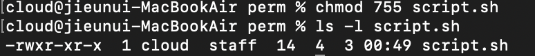
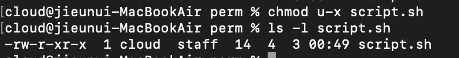
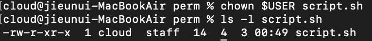

# 🧪 실습 기록 - labs.md

> 명령어 실습과 결과를 정리하는 공간입니다.

---

## 📚 Day 3 - 리눅스 명령어 실습

```
mkdir testfolder
cd testfolder
touch note.txt
echo "hello" > note.txt
cat note.txt
cp note.txt copy.txt
mv copy.txt final.txt
rm note.txt
```

## 🖼️ 실습 스크린샷

아래는 명령어 실행 후 실제 결과를 확인한 화면입니다.
파일에 내용을 입력하고, 복사·이동·삭제하는 흐름을 확인할 수 있습니다.

 <br> 

> **cat으로 내용 확인**

<br> 

> **cp → mv → rm 명령어로 파일을 복사, 이름 변경, 삭제까지 수행**

<br> 

> **인용부호(>)부재로 인하여 출력오류**


## 🛠️ Troubleshooting & 기록

echo 명령어에서 작은따옴표(' ')를 사용할 경우, **문자열 처리 방식에 차이**가 있으므로 주의가 필요하다.

rm 명령어는 **복구가 불가능**하므로, 삭제 전에 반드시 파일명을 재확인해야 한다.

## 💭 느낀 점
이전에는 파일을 만드는 것도 GUI(마우스)로만 해봤지만,
터미널에서 키보드만으로 작업을 해보니 **훨씬 효율적이고 직관적인 방식**이라는 걸 느꼈다.
기본 명령어인 cat, echo, mv, rm 등을 직접 써보며
“나도 점점 개발자가 되어가고 있구나”라는 실감을 얻었다.

---

---

## ✅ 학습 주제  
- 리눅스 파일 권한과 소유자 변경

---

## 📘 1. 개념 정리  
- 리눅스의 파일 권한은 세 부분으로 구성된다: 소유자(owner), 그룹(group), 기타(other)  
- 권한은 `r`(읽기), `w`(쓰기), `x`(실행)으로 표시되며, 숫자로는 4, 2, 1로 계산  
- `chmod` 명령어를 사용해 권한을 설정하며, 대표적으로 `chmod 755`는 `rwxr-xr-x` 권한  
- `chown`은 파일의 소유자를 변경할 때 사용하며, 일반적으로 `sudo` 권한이 필요  
- `$USER`는 현재 로그인된 사용자의 계정 이름을 의미하는 환경 변수  
- `ls -l` 명령어를 통해 파일의 소유자 및 권한을 확인할 수 있음

---

## 🧪 2. 실습 내용  

```
mkdir perm-test
cd perm-test
touch script.sh
ls -l script.sh

chmod 755 script.sh
ls -l script.sh

chmod u-x script.sh
ls -l script.sh

sudo chown $USER script.sh
ls -l script.sh

```

## 🖼️ 실습 스크린샷

아래는 명령어 실행 후 실제 결과를 확인한 화면입니다.
파일 권한을 설정하고 변경하며, 시스템 상의 접근 권한이 어떻게 바뀌는지를 확인했습니다.

 <br> 

> **script.sh 파일 생성 직후 기본 권한 확인**

<br> 

> **chmod 755 적용 후 실행 권한 부여됨**

<br> 

> **사용자 실행 권한 제거 후 권한 변화**

<br> 

> **chown 명령어로 소유자를 자신으로 재지정한 결과**

## 🛠️ Troubleshooting & 기록
별다른 에러 없이 실습이 진행됨

이미 파일 소유자가 $USER와 동일한 경우, **chown 명령어는 sudo 없이**도 실행됨

## 💭 느낀 점
숫자 기반의 권한 설정 방식이 실제로 손에 익기 시작했고, **rwx 구조**가 읽히기 시작했다
ls -l 명령어로 권한을 시각적으로 확인하며 시스템 내부 구조를 체득할 수 있었다
**명령어 하나로 시스템 파일을 통제**하는 느낌이 강해져, 리눅스에 대한 자신감이 생겼다

